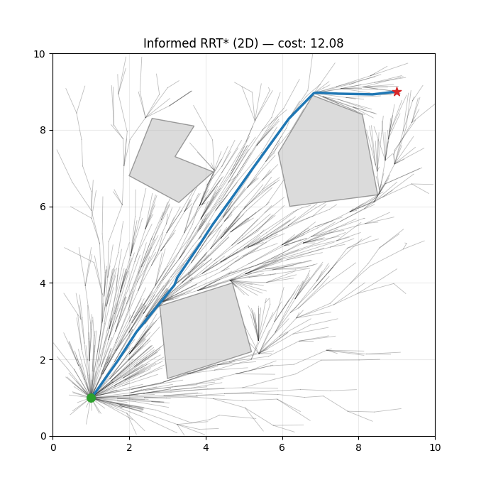
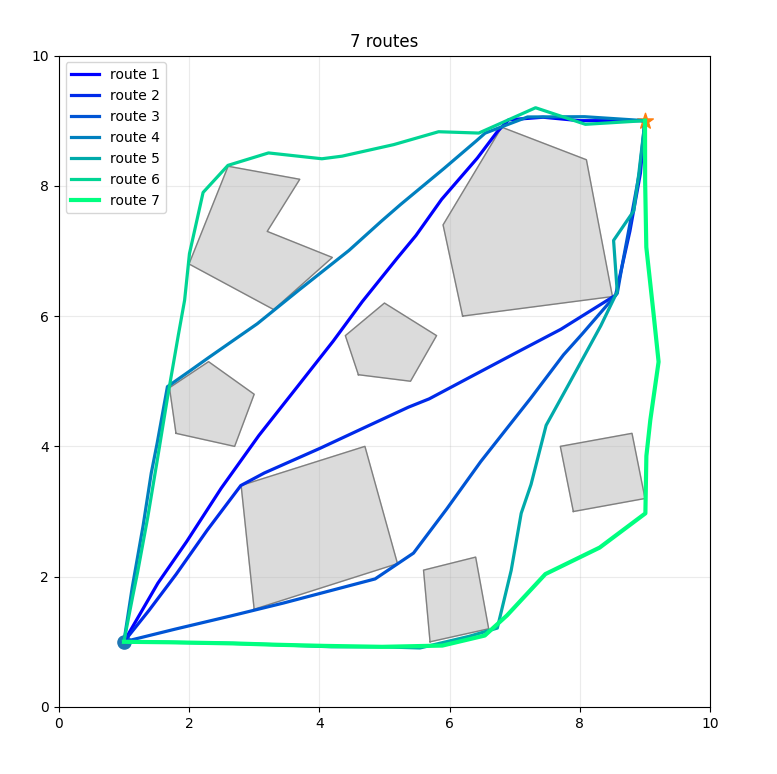
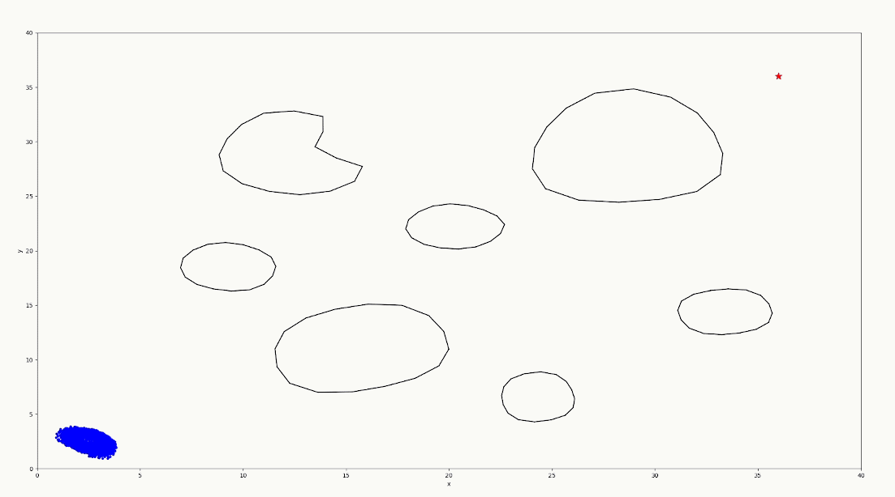
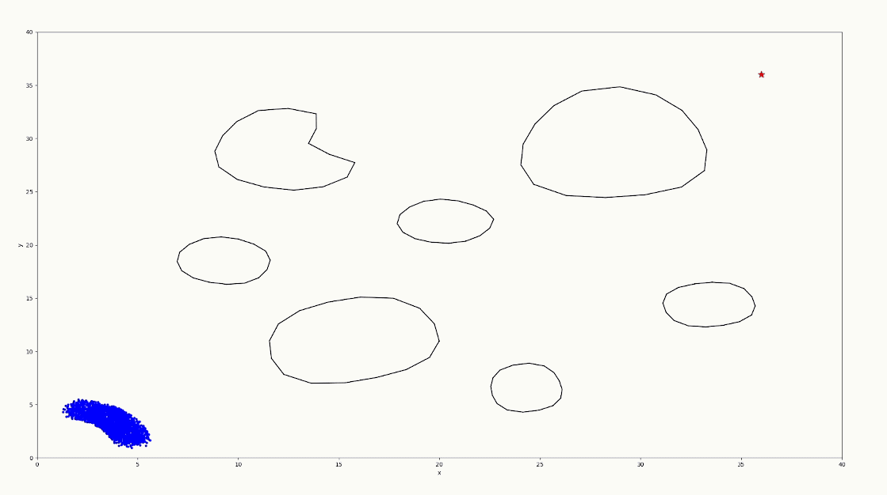
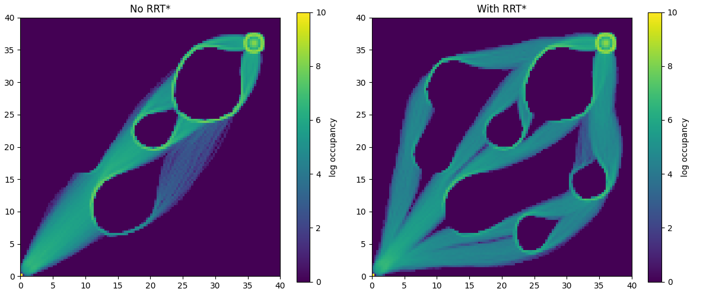

# Informed RRT* × Fish Schooling × Live GMR  
### Dense & Diverse Exploration for Probabilistic Shared Autonomy

[](https://www.python.org/)
[](#)
[](#)
[](#)
[](LICENSE)

This repository combines:

- **Informed RRT\*** for structured, multi-route path generation  
- **Reynolds-inspired fish schooling** for dense collective exploration  
- **Gaussian Mixture Regression (GMR)** for live probabilistic trajectory modeling  
- A unified framework for **diverse exploration, trajectory aggregation, and shared autonomy**

The system generates **multiple distinct routes**, fills them with **hundreds of interacting agents**, and continuously fits a **probabilistic motion model** from collective behavior.

This work is inspired by:
- Informed RRT*: [Optimal sampling-based path planning focused via direct sampling of an admissible ellipsoidal heuristic, Gammell et al](https://www.researchgate.net/profile/Siddhartha-Srinivasa/publication/261512737_Informed_RRT_Optimal_Incremental_Path_Planning_Focused_through_an_Admissible_Ellipsoidal_Heuristic/links/5866b39708ae329d62075166/Informed-RRT-Optimal-Incremental-Path-Planning-Focused-through-an-Admissible-Ellipsoidal-Heuristic.pdf)
- Reynolds Fish Schooling Model [Craig Reynolds' Boids (1987)](https://dl.acm.org/doi/pdf/10.1145/37401.37406)


---

# 1️⃣ Informed RRT with multiple branching*

## 🎯 Motivation

<div align="center">

</div>

Classical RRT* (informed or not) finds one optimal path.  
In complex environments, we want:

- Multiple **distinct routes**
- Controlled exploration bias
- Structured branching
- Fast nearest-neighbor queries

## 🔁 Iterative Blocking RRT*

<div align="center">

</div>

We extend RRT* by:

1. Running RRT* until a solution is found
2. Extracting the optimal path
3. Adding thin blocking walls along that path using a heuristic function (based on narrowness and position in the graph)
4. Re-running RRT* to discover alternative corridors
5. Repeating until failure

This produces a **set of topologically distinct paths**.

### Key properties

- Asymptotically optimal per route
- Spatially separated solutions
- Produces a goal graph structure
- Efficient via KD-tree nearest search
- Collision checking accelerated with Numba

---

# 2️⃣ Fish Schooling — Reynolds Model Extension

## 🐠 Biological Inspiration

Based on:

- **Craig Reynolds (1987)**
- Separation
- Alignment
- Cohesion

Extended with:

- Obstacle avoidance
- Goal attraction (weighted graph transitions)
- Velocity smoothing
- Density control
- Local interaction radius

## ⚙️ Dynamics

Each agent updates according to:

```
v = w_sep * separation
  + w_align * alignment
  + w_coh * cohesion
  + w_goal * goal_attraction
  + w_avoid * obstacle_repulsion
```

Agents interact locally, producing:

- Lane formation
- Corridor emergence
- Natural obstacle sliding
- Multi-route density patterns
  
Parameters where optimized using Reinforcement Learning, see https://github.com/fleurssauvages/Fish_School_and_GMR_Prediction for more details

---

# 3️⃣ Informed RRT* × Fish Schooling

## 🌊 Why Combine Them?

RRT* gives:
- Sparse geometric solutions

Fish schooling gives:
- Dense, emergent flow
- Stochastic variation
- Robust obstacle negotiation

Together:

- RRT* defines **macro-level topology**
- Fish define **micro-level exploration**
- Result: dense occupation maps over multiple valid routes

## 🧭 Goal Graph Construction

All RRT* paths are merged into a **goal transition graph**:

- Nodes = merged waypoints
- Edges = successor relations
- Terminal nodes = self-loop absorbing states

Fish probabilistically transition through this graph.

---

# 4️⃣ Dense & Diverse Exploration

Running hundreds of agents per route produces:

- Rich trajectory datasets
- Natural variance in path following
- Smooth corridor distributions
- Avoidance of deterministic overfitting

We then:

- Filter early arrivals
- Remove oscillatory/stuck trajectories
- Keep the first X successful arrivals

This yields a high-quality demonstration set.

### 🔹 Fish without RTT midpoints
<div align="center">

</div>

### 🔹 Fish with RTT midpoints
<div align="center">

</div>

### 🔹 Occupation Map Comparision
<div align="center">

</div>

---

# 5️⃣ Live Gaussian Mixture Regression (GMR)

## 📊 Why GMR?

We want:

- Probabilistic motion prediction
- Mean trajectory
- Covariance envelopes
- Multi-modal structure

## 🧠 Pipeline

1. Select demonstrations near current cursor history
2. Fit GMM (EM)
3. Perform GMR regression
4. Extract:
   - μ(t)
   - Σ(t)
   - posterior weights

## 🔄 Live Updating

At runtime:

- Cursor moves
- Nearby demos reselected
- GMM updated (few EM iterations)
- Mean & covariance updated
- Ellipses plotted only ahead of current time index

This produces:

- Causal prediction
- Receding-horizon behavior
- Smooth shared autonomy guidance

### 🔹 Live GMR Update
<div align="center">

</div>

---

# 6️⃣ Shared Autonomy Layer

A shared autonomy layer can be then derived using: https://github.com/fleurssauvages/Fish_School_and_GMR_Prediction

# 8️⃣ Project Structure

```
RRTstar_reroute.py
    Iterative blocking RRT*
    KD-tree acceleration
    Numba collision kernels

env2D.py
    FishGoalEnv2D
    Goal graph transitions
    Obstacle avoidance

RRT_and_fishes.py
    Full integration
    Heatmaps
    Demo filtering
    Live GMR

GMR/
    GMM + GMR implementation
```

---

# 9️⃣ Main Capabilities

✔ Multi-route optimal planning  
✔ Dense emergent flow generation  
✔ Trajectory filtering  
✔ Live probabilistic modeling  
✔ Shared control blending  
✔ Occupancy heatmaps  
✔ Real-time visualization  

---

# 🔬 Conceptual Summary

| Component | Role |
|-----------|------|
| Informed RRT* | Structural exploration |
| Fish Schooling | Dense stochastic sampling |
| Filtering | Quality control |
| GMR | Probabilistic motion manifold |
| Shared Control | Human–model blending |

---

# 📜 License

MIT License

---

# ⭐ Acknowledgments

- Craig Reynolds — Boids (1987)
- RRT* — Karaman & Frazzoli (2011)
- Informed RRT* - Gammell (2014)
